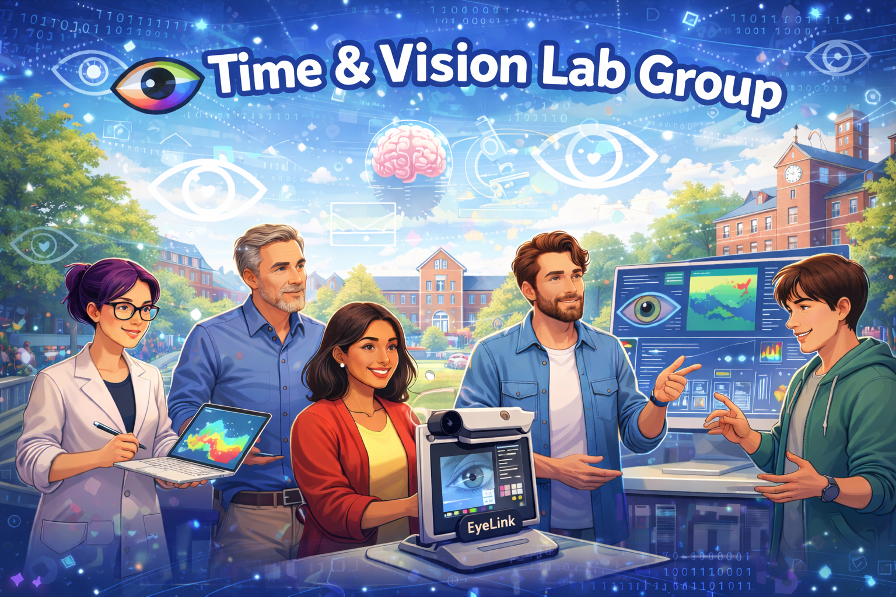

# Time and Vision Lab Group

A shared community across the Bruno and Souto labs in the School of Psychology and Vision Sciences (University of Leicester), focused on time perception, vision, attention, and eye movements. The aim is to foster collaboration, mutual support, and clear communication of methods and ideas across projects.

  

## What this repository is for

This is the central repository for:
- Meeting notes and minutes
- Slides and other presentation materials
- Shared files that support discussion (figures, papers, links, small datasets where appropriate)

Everything is organised by meeting, with a subfolder created for each meeting. Important notices (for example schedule changes, room changes, urgent updates) should be either:
- pinned as a GitHub Issue or Discussion, and linked from the relevant meeting folder, or
- placed in `announcements/` and linked from the relevant meeting folder and the indexes

Important items should be easy to find. If something matters beyond a single meeting, ensure it is indexed in `announcements/README.md` and, where appropriate, linked from the meeting record.

## Research themes

- Time perception
- Vision science
- Eye tracking
- Attention
- Psychophysics
- Methods and modelling

## Aims

### Collaborate
- Cross-project support on design, analysis, and methods
- Shared troubleshooting and workflow tips
- Opportunities for co-authorship and shared datasets

### Communicate
- Practise explaining ideas clearly, with slides encouraged for informal talks
- Structured, supportive feedback
- Better shared understanding across the labs

### Maintain momentum
- Progress updates and soft deadlines
- Project planning and prioritisation
- Space to flag blockers early

## Meetings

We meet fortnightly, alternating between:
- Mondays 12:00 to 13:00
- Thursdays 14:00 to 15:00

Rooms are typically in the George Davies Centre (GDC) and may vary by date.

### Format
Informal, supportive, practical. Slides are encouraged. Updates can be short, especially when the goal is feedback on a specific method or decision.

### Typical agenda
- Lab updates and important dates
- Introductions for new members
- Progress reports
- Optional presentations for feedback

### Presenting
If you have something you want feedback on, you can present at any meeting. Sending slides ahead of time can help keep the session smooth.

## Where to find things

### Meeting records
Meeting folders are stored as:

`meetings/<YEAR>/<Month>/<DD-MM-YY>/`

Example:
- `meetings/2026/February/16-02-26/`

Each meeting folder should typically include:
- `README.md` (meeting record and links)
- `minutes.md`
- `action-items.md`
- `slides/`
- optional: `files/`

### Indexes and templates
- Meeting index: `meetings/README.md`
- Meeting template: `meetings/_TEMPLATE/README.md`
- Notices index: `announcements/README.md` (plus pinned Issues or Discussions where used)

## People

### Senior staff
- Dr Aurelio Bruno
- Dr David Souto

### Other staff
- Dr Emma Bridger
- Dr Richard J. Leadbeater

### PhD
- Liam Jordan
- Xin Liu
- Milena Rota

### Masters and undergraduate researchers
- Princilla Agyemang
- Habiba O. M. Elbadry
- Helena Tatay Marco
- Pravarthika Ravishankar
- Sky D. Rupac
- Umul Sheikh
- Nick S. Trajcevski

If you are a member and want your name, role, or link updated, email Liam.

## Contact

For meeting structure and supervision:
- aurelio.bruno@leicester.ac.uk
- david.souto@leicester.ac.uk

For page edits, logistics, or quick updates:
- lgj6@le.ac.uk

## Confidentiality and sharing

This repository may include unpublished ideas, slides, and in-progress work. Do not share materials outside the group unless the relevant presenter or supervisor has explicitly agreed.

## Last updated

February 2026
